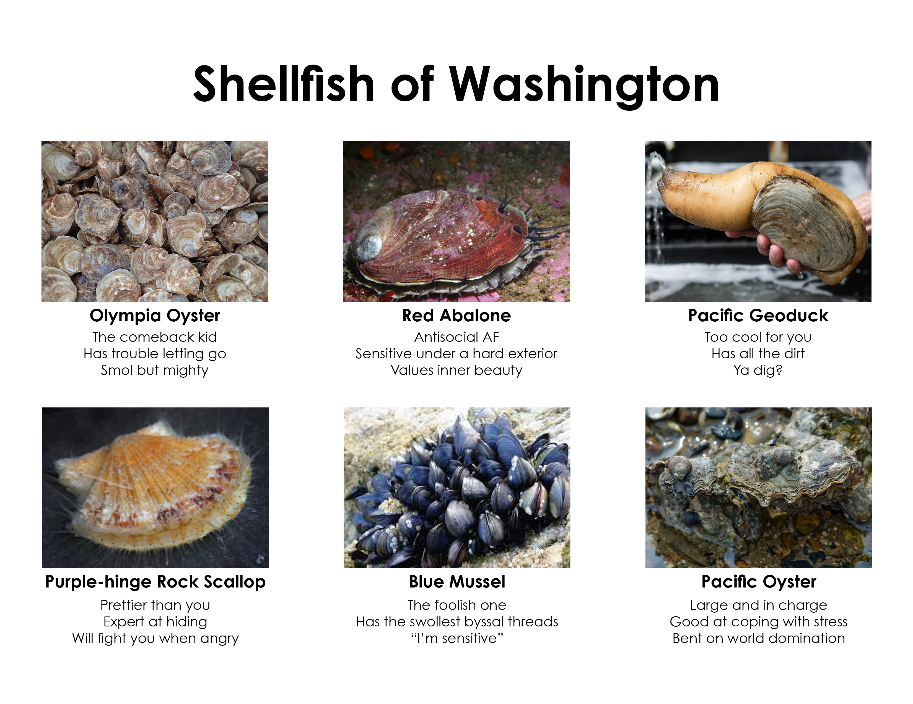

# Pt Whitney Shellfish Hatchery Tour

Some of the shellfish species we focus on are Pacific geoduck (“gooey-duck”) clams, Pacific oysters, and Olympia oysters. These animals are called bivalves (find them in our shellfish meme)!

       
A meme with six shellfish you may encounter in Washington (from top left to bottom right: Olympia Oyster, Red Abalone, Pacific Geoduck, Purple-hinge Rock Scallop, Blue Mussel, Pacific Oyster) that pokes fun at some of the traits these animals have.

A shellfish hatchery is a place where shellfish are grown, either for food or for scientific experiments like ours. Usually, conducting an experiment in a hatchery is the first step of our scientific process! In the video below, Steven will walk you through the Pt. Whitney Shellfish Hatchery on the Olympic Peninsula in Washington. This hatchery is owned and operated by the Jamestown S'klallam Tribe, and we run some experiments here with the tribe. 

While you watch the video, listen for these words and phrases! Can you figure out what they mean?

- Hatchery
- Geoduck
- Oyster
- Downwelling
- Upwelling
- Microalgae
- Microscope
- Tank
- Larvae 
- Gametes
- Spawning
- Juvenile

<iframe width="672" height="378" src="https://www.youtube.com/embed/BWtLFbP0Ka8" title="YouTube video player" frameborder="0" cc_load_policy=1&cc_lang_pref=en allow="accelerometer; autoplay; clipboard-write; encrypted-media; gyroscope" allowfullscreen></iframe>

### Hatchery Tour Wordsearch!
In the video, you may have heard some words we use when working at Pt. Whitney! Can you match these words to their definitions, and find them in our wordsearch? Click the button below to start the search! 

| Term        | Definition                                                          |
|-------------|---------------------------------------------------------------------|
| Hatchery    | Place where shellfish are grown for food or research                |
| Geoduck     | A type of clam that we study                                        |
| Oyster      | A type of bivalve that we study that isn’t a clam                   |
| Downwelling | Water flows downward in tanks                                       |
| Upwelling   | Water flows upward                                                  |
| Microalgae  | What do hatchery workers feed the oysters?                          |
| Microscope  | Something that can help us look at things that are tiny             |
| Tank        | A container that can hold water, algae, or shellfish                |
| Larvae      | Baby shellfish                                                      |
| Gametes     | Sperm and eggs that help create baby shellfish                      |
| Spawning    | When adult shellfish release their gametes to create baby shellfish |
| Juvenile    | Shellfish that aren’t babies, but aren’t adults yet!                |

